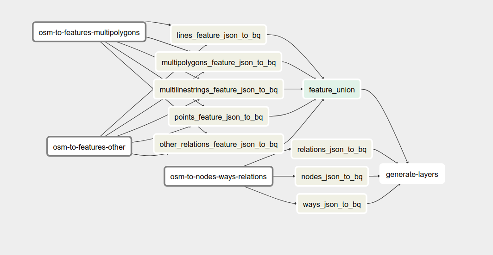

# OSM to BigQuery 

This doc describes a setup process of the [Cloud Composer](https://cloud.google.com/composer) pipeline 
for exporting [OSM planet](https://planet.openstreetmap.org/) files to [BigQuery](https://cloud.google.com/bigquery).



### Source files
URL of the source Planet file and it's MD5 hash should be saved into following variables:
```
OSM_URL=https://ftp5.gwdg.de/pub/misc/openstreetmap/planet.openstreetmap.org/pbf/planet-latest.osm.pbf
OSM_MD5_URL=https://ftp5.gwdg.de/pub/misc/openstreetmap/planet.openstreetmap.org/pbf/planet-latest.osm.pbf.md5
```
There is some restrictions for the original Planet file mirror 
that not allow to use Storage Transfer API for copying files. 
That why we suggest to use of of the alternative [mirrors](https://wiki.openstreetmap.org/wiki/Planet.osm#Download),
 e.g. [GWDG](https://ftp5.gwdg.de/pub/misc/openstreetmap/planet.openstreetmap.org/)

### Environment preparing
Following steps should be performed to prepare your GCP environment: 
1. Make sure you have created [Google Cloud Project](https://console.cloud.google.com) and linked it to a billing account.
Store project id and environment location into your shell session with the following command: 
    ```bash
    PROJECT_ID=`gcloud config get-value project`
    REGION_LOCATION=`gcloud config get-value compute/region`
    ```
2. Enable the [Cloud Composer API](https://console.cloud.google.com/apis/library/composer.googleapis.com) 
3. Enable the [Storage Transfer API](https://console.cloud.google.com/apis/library/storagetransfer.googleapis.com) 
4. Create GCS buckets:

    - For GCS Transfer of the source files:
    ```bash
    TRANSFER_BUCKET_NAME=${PROJECT_ID}-transfer
    gsutil mb gs://${TRANSFER_BUCKET_NAME}/
    ```
    - For intermediate results:
    ```bash
    WORK_BUCKET_NAME=${PROJECT_ID}-work
    gsutil mb gs://${WORK_BUCKET_NAME}/
    ```
5. Add the [required permissions](https://cloud.google.com/storage-transfer/docs/configure-access) 
for using [Storage Transfer API](https://console.cloud.google.com/apis/library/storagetransfer.googleapis.com). 
Don't miss to add a `roles/storage.legacyBucketReader` role to your Storage Transfer Service Account for the `TRANSFER_BUCKET_NAME` 
(this process described at the [Setting up access to the data sink](https://cloud.google.com/storage-transfer/docs/configure-access#sink) section)
6. Create the [BigQuery](https://cloud.google.com/bigquery) dataset:
    ```bash
    BQ_DATASET=osm_to_bq # customize dataset name
    bq mk ${PROJECT_ID}:${BQ_DATASET}
    ```
### Uploading images to Container Registry
1. Choose a hostname, which specifies location where you will store the image. Details: [Pushing and pulling images
](https://cloud.google.com/container-registry/docs/pushing-and-pulling)
    ```bash
    IMAGE_HOSTNAME=(image_hostname) # e.g. `gcr.io` to hosts images in data centers in the United States
    ```
2. Build and upload to Container Registry `osm_to_features` Docker image: 
    ```bash
    OSM_TO_FEATURES_IMAGE=$IMAGE_HOSTNAME/$PROJECT_ID/osm_to_features
    docker build -t $OSM_TO_FEATURES_IMAGE tasks_docker_images/osm_to_features/
    docker push $OSM_TO_FEATURES_IMAGE
    ```
3. Build and upload to Container Registry `osm_to_nodes_ways_relations` Docker image:
    ```bash
    OSM_TO_NODES_WAYS_RELATIONS_IMAGE=$IMAGE_HOSTNAME/$PROJECT_ID/osm_to_nodes_ways_relations
    docker build -t $OSM_TO_NODES_WAYS_RELATIONS_IMAGE tasks_docker_images/osm_to_nodes_ways_relations/
    docker push $OSM_TO_NODES_WAYS_RELATIONS_IMAGE
    ```
3. Build and upload to Container Registry `generate_layers` Docker image:
    ```bash
    GENERATE_LAYERS_IMAGE=$IMAGE_HOSTNAME/$PROJECT_ID/generate_layers
    docker build -t $GENERATE_LAYERS_IMAGE tasks_docker_images/generate_layers/
    docker push $GENERATE_LAYERS_IMAGE
    ```

### Composer setup
1. Create the [Cloud Composer](https://cloud.google.com/composer) environment:
    ```bash
    COMPOSER_ENV_NAME=osm-to-bq
    gcloud composer environments create $COMPOSER_ENV_NAME \
        --location $REGION_LOCATION
    ```
### Create GKE node pools
For resource high-consuming operations we should create 
separate [GCK node pools](https://cloud.google.com/composer/docs/how-to/using/using-kubernetes-pod-operator#node-pool)
1. Get needed parameters for the GKE node pool creation:
    ```bash
    GKE_CLUSTER_FULL_NAME=$(gcloud composer environments describe $COMPOSER_ENV_NAME \
        --location $REGION_LOCATION --format json | jq -r '.config.gkeCluster')
    GKE_CLUSTER_NAME=$(echo $GKE_CLUSTER_FULL_NAME | awk -F/ '{print $6}')
    GKE_ZONE=$(echo $GKE_CLUSTER_FULL_NAME | awk -F/ '{print $4}')
    ```
2. Create node pool for the `osm_to_features` operation:
    ```buildoutcfg
    OSM_TO_FEATURES_POOL_NAME=osm-to-features-pool
    OSM_TO_FEATURES_POOL_MACHINE_TYPE=n1-highmem-32
    OSM_TO_FEATURES_POOL_NUM_NODES=2
    OSM_TO_FEATURES_POOL_DISK_SIZE=1200
    gcloud container node-pools create $OSM_TO_FEATURES_POOL_NAME \
        --cluster $GKE_CLUSTER_NAME \
        --project $PROJECT_ID \
        --zone $GKE_ZONE \
        --machine-type $OSM_TO_FEATURES_POOL_MACHINE_TYPE \
        --num-nodes $OSM_TO_FEATURES_POOL_NUM_NODES \
        --disk-size $OSM_TO_FEATURES_POOL_DISK_SIZE \
        --scopes gke-default,storage-rw
    ```
3. Save value of requested memory for `osm_to_features` into variable:
    ```
    OSM_TO_FEATURES_POD_REQUESTED_MEMORY=170G
    ```
4. Create node pool for the `osm_to_nodes_ways_relations` operation:
    ```buildoutcfg
    OSM_TO_NODES_WAYS_FEATURES_POOL_NAME=osm-to-nodes-ways-relations-pool
    OSM_TO_NODES_WAYS_FEATURES_POOL_MACHINE_TYPE=n1-highmem-4
    OSM_TO_NODES_WAYS_FEATURES_POOL_NUM_NODES=1
    OSM_TO_NODES_WAYS_FEATURES_POOL_DISK_SIZE=1200
    gcloud container node-pools create $OSM_TO_NODES_WAYS_FEATURES_POOL_NAME \
        --cluster $GKE_CLUSTER_NAME \
        --project $PROJECT_ID \
        --zone $GKE_ZONE \
        --machine-type $OSM_TO_NODES_WAYS_FEATURES_POOL_MACHINE_TYPE \
        --num-nodes $OSM_TO_NODES_WAYS_FEATURES_POOL_NUM_NODES \
        --disk-size $OSM_TO_NODES_WAYS_FEATURES_POOL_DISK_SIZE \
        --scopes gke-default,storage-rw
    ```
### Set pipeline parameters into Composer env vars 
1. Fill `deployment/config/config.json` with the project's parameters using `deployment/config/generate_config.py` script:
    ```
    CONFIG_FILE=deployment/config/config.json
    python3 deployment/config/generate_config.py $CONFIG_FILE \
        --project_id=$PROJECT_ID \
        --osm_url=$OSM_URL \
        --osm_md5_url=$OSM_MD5_URL \
        --gcs_transfer_bucket=$TRANSFER_BUCKET_NAME \
        --features_dir_gcs_uri=gs://$WORK_BUCKET_NAME/features/ \
        --nodes_ways_relations_dir_gcs_uri=gs://$WORK_BUCKET_NAME/nodes_ways_relations/ \
        --transfer_index_files_dir_gcs_uri=gs://$WORK_BUCKET_NAME/gsc_transfer_index/ \
        --osm_to_features_image=$OSM_TO_FEATURES_IMAGE \
        --osm_to_nodes_ways_relations_image=$OSM_TO_NODES_WAYS_RELATIONS_IMAGE \
        --osm_to_features_gke_pool=$OSM_TO_FEATURES_POOL_NAME \
        --osm_to_features_gke_pod_requested_memory=$OSM_TO_FEATURES_POD_REQUESTED_MEMORY \
        --osm_to_nodes_ways_relations_gke_pool=$OSM_TO_NODES_WAYS_FEATURES_POOL_NAME \
        --generate_layers_image=$GENERATE_LAYERS_IMAGE \
        --bq_dataset_to_export=$BQ_DATASET
    ```
2. Set variables from `deployment/config/config.json` to Cloud Composer environment:
    ```bash
    deployment/config/set_env_vars_from_config.sh $CONFIG_FILE $COMPOSER_ENV_NAME $REGION_LOCATION   
    ```

### Setup OSM_TO_BQ triggering
1. Set your Composer Environment Client Id to `COMPOSER_CLIENT_ID`.
You can use `utils/get_client_id.py` script to get your ID:
    ```bash
    COMPOSER_CLIENT_ID=$(python3 utils/get_client_id.py $PROJECT_ID $REGION_LOCATION $COMPOSER_ENV_NAME  2>&1 | tail -n1)
    ```
2. Set your Airflow WebServer Id to `COMPOSER_WEBSERVER_ID` with the following this command:
    ```bash
   COMPOSER_WEBSERVER_ID=$(gcloud composer environments describe $COMPOSER_ENV_NAME \
        --location $REGION_LOCATION --format json | \
        jq -r '.config.airflowUri' | \
        awk -F/ '{print $3}' | \
        cut -d '.' -f1)
    ```
3. Create a [Cloud Function](https://cloud.google.com/functions) that will trigger `osm-to-bq` after source OSM file transfer:
    ```bash
    TRIGGER_FUNCTION_NAME=trigger_osm_to_big_query_dg_gcf
    gcloud functions deploy $TRIGGER_FUNCTION_NAME \
        --source triggering/trigger_osm_to_big_query_dg_gcf \
        --entry-point trigger_dag \
        --runtime python37 \
        --trigger-resource $TRANSFER_BUCKET_NAME \
        --trigger-event google.storage.object.finalize \
        --set-env-vars COMPOSER_CLIENT_ID=$COMPOSER_CLIENT_ID,COMPOSER_WEBSERVER_ID=$COMPOSER_WEBSERVER_ID
    ```

### Uploading DAGs and running
1. Upload DAG's and it's dependency files to the environment GCS:
    ```bash
    DAGS_PATH=dags/*
    for DAG_ELEMENT in $DAGS_PATH; do
      deployment/upload_dags_files.sh $DAG_ELEMENT $COMPOSER_ENV_NAME $REGION_LOCATION
    done  
    ```
After you upload all DAG files and it's dependencies, the pipeline will automatically start according to `start_date` and `schedule_intervals` parameters that are set in the DAG files.

### Inspecting
Now you can move to the Airflow web interface to inspect details of running pipeline.
To access the Airflow web interface from the Google Cloud Console:

1. To view your existing Cloud Composer environments, open the [Environments page](https://console.cloud.google.com/composer/environments).
2. In the Airflow webserver column, click the new window icon for the environment whose Airflow web interface you want to view.
3. Log in with the Google account that has the appropriate permissions.
